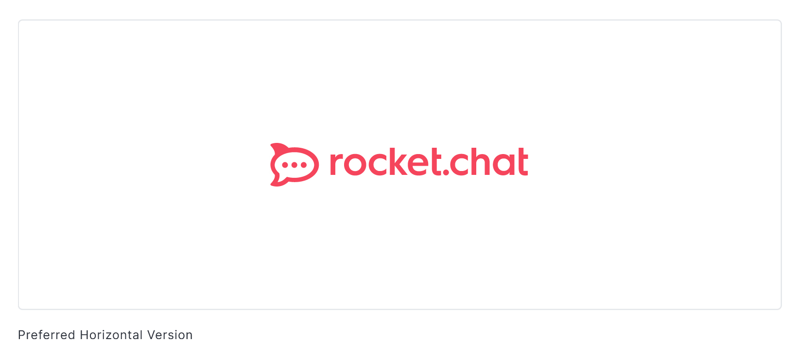

# Rocket.Chat

Rocket.Chat is a Web Chat Server, developed in JavaScript, using the Meteor fullstack framework.

It is a great solution for communities and companies wanting to privately host their own chat service or for developers looking forward to build and evolve their own chat platforms.

# How to use this image
### Docker Compose

This docker compose is deprecated, for update please refer to https://docs.rocket.chat/docs/deploy-with-docker-docker-compose or https://github.com/RocketChat/rocketchat-compose

